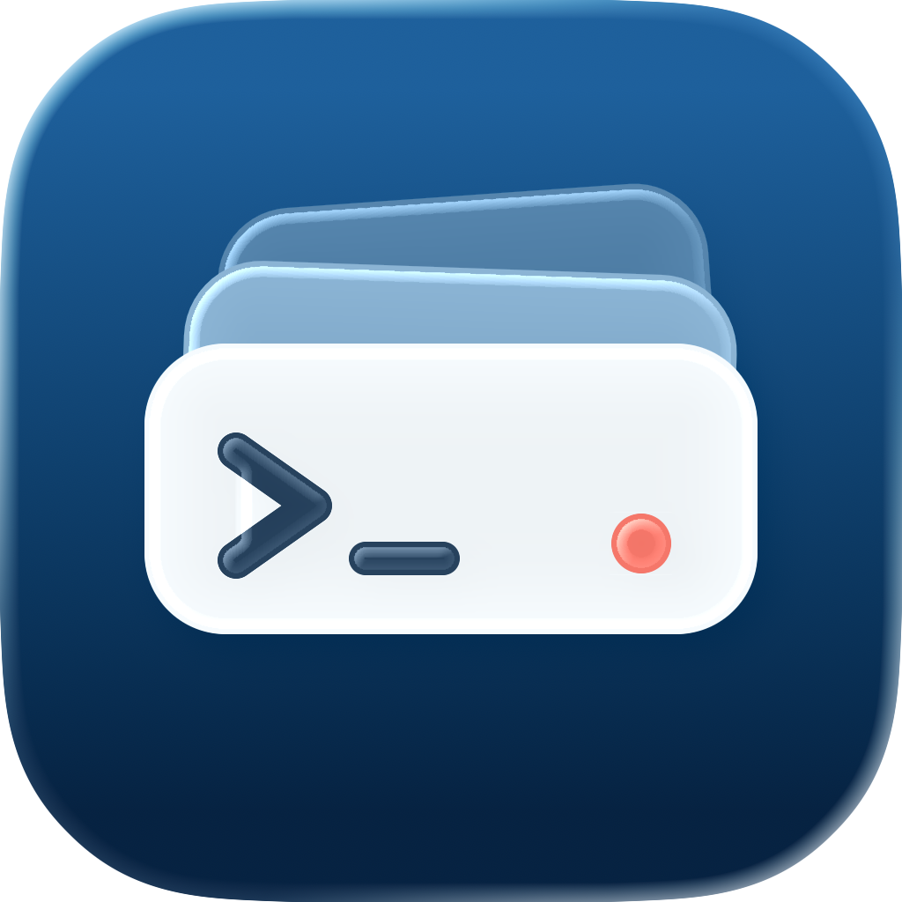

<p align="center">
  
</p>

<h1 align="center">Aloft</h1>

<p align="center">
  原生 macOS 菜单栏命令管理器，用一个入口启动、监控和管理长期运行的开发命令。
</p>

Aloft 面向 `pnpm start`、`npm run dev`、`cargo watch` 等持续运行的命令。它将每条命令放进独立的 POSIX 会话和进程组，通过 PTY 捕获终端输出，并在菜单栏实时展示运行状态、关键词命中和异常退出。

## 功能

- 为命令设置名称、工作目录、Shell、执行内容和关键词。
- 工作目录支持文件夹选择、手动输入和 `~` 展开。
- 从 `/etc/shells` 中列出可执行且受支持的 POSIX Shell：`sh`、`bash`、`dash`、`ksh`、`zsh`。
- 默认使用当前 macOS 账户的默认 Shell，并加载它的登录和交互式初始化环境。
- 使用分组组织命令，支持整组启动、停止和重启；批量启动会跳过已经运行的条目。
- 菜单栏实时显示运行数量、运行中的条目、最新关键词命中和待处理异常。
- 使用真实 PID、PGID、`waitpid` 和内核进程组探测监控状态，不通过 UI 状态推算进程存活。
- 通过 PTY 展示 ANSI 颜色、True Color、光标控制和 Unicode 输出。
- 优先使用 SwiftTerm Metal 渲染器，Metal 不可用时回退到 Core Graphics。
- 终端保留 20,000 行回滚记录，支持鼠标选择和 `⌘C` 复制。
- 可设置终端等宽字体和字号。
- 进程异常退出、停止失败或重启失败时显示菜单栏提醒和 macOS 通知。
- 支持阿拉伯语、德语、英语、西班牙语、法语、日语、韩语、巴西葡萄牙语、俄语、简体中文和繁体中文，自动跟随系统语言。

## 系统要求

- macOS 14 或更高版本
- Swift 6 工具链
- 完整 Xcode 安装，用于通过 `actool` 构建 macOS 应用图标
- Ghostty 1.3.0 或更高版本（可选）

Swift Package Manager 会固定使用 SwiftTerm `1.15.0`。

## 从源码安装

```bash
git clone https://github.com/zhengrenzhe/Aloft.git
cd Aloft
./script/build_and_run.sh --install-release
```

`--install-release` 会执行 Release 构建、本地 ad-hoc 签名和签名校验，在临时目录中完成安装准备后替换 `/Applications/Aloft.app`，然后启动已安装版本。替换失败时，脚本会恢复安装前的应用。

该模式会先请求正在运行的 Aloft 退出。Aloft 会尝试安全停止全部托管进程；仍有进程组存活时，应用拒绝退出，安装脚本也会终止，不会直接覆盖运行中的版本。

构建过程最终只在 `dist/` 中保留 `Aloft.zip`，不会保留另一个可被 Launchpad 识别的 `dist/Aloft.app`。

只生成可分发压缩包、不安装或启动应用：

```bash
./script/build_and_run.sh --stage-release
```

产物路径：

```text
dist/Aloft.zip
```

## 使用

1. 从菜单栏打开 Aloft。
2. 创建分组，例如 `Frontend`、`Backend` 或 `Infrastructure`。
3. 在分组中添加命令，并填写：
   - Name：菜单和列表中显示的名称。
   - Working Directory：命令执行目录。
   - Shell：系统中可用且 Aloft 支持的 Shell。
   - Command：交给 Shell 执行的完整命令。
   - Keywords：需要从输出中匹配的内容。
4. 启动单条命令，或使用分组的 Start All。
5. 在主窗口查看终端输出、PID、PGID、最近一次终止结果和关键词命中。

配置会以原子写入方式保存在：

```text
~/Library/Application Support/Aloft/config.json
```

## 进程管理语义

Aloft 的进程管理建立在标准 POSIX API 上：

- `openpty` 创建伪终端。
- `fork` 创建子进程。
- `setsid` 创建独立会话和进程组。
- `TIOCSCTTY` 将 PTY 设置为控制终端。
- `dup2` 将标准输入、输出和错误连接到 PTY。
- `chdir` 切换到条目配置的工作目录。
- `exec` 启动用户选择的 Shell。
- `waitpid` 获取进程退出码或终止信号。
- `killpg(pgid, 0)` 探测整个进程组的真实存活状态。

停止命令时，Aloft 向整个进程组发送 `SIGTERM`，并等待最多 5 秒。Aloft 不会自动发送 `SIGKILL`：如果进程组拒绝退出，条目保持运行状态，输出和进程身份会继续保留，同时界面与通知中心会报告停止失败。

成功停止后终端内容会清空；重启会保留已有输出，并插入新的会话分隔线。

## 终端与 Ghostty

内嵌终端当前为只读终端：支持 ANSI/VT 渲染、滚动、选择和复制，不会把键盘输入或粘贴内容发送给托管进程。

安装 Ghostty 1.3.0 或更高版本后，可以使用 **Open in Ghostty**。该操作通过 Ghostty 的 AppleScript API，在对应工作目录中打开一个新的 Ghostty 窗口。

Ghostty 窗口是独立 Shell，不会挂载或接管 Aloft 已经创建的 PTY，也不会连接到正在托管的进程输入流。

## 开发与验证

运行完整测试：

```bash
swift test
```

构建 Swift Package：

```bash
swift build
```

执行 Release 终端性能矩阵：

```bash
./script/run_terminal_benchmarks.sh
```

性能脚本覆盖纯 UTF-8、ANSI 进度更新、光标寻址、Unicode/Emoji 和连续控制序列，并分别测试文本管线、SwiftTerm Core Graphics 与 SwiftTerm Metal 后端。

## 代码结构

- `Sources/AloftProcess`：PTY、会话、进程组、信号和 `waitpid` 的 C/POSIX 边界。
- `Sources/AloftApp/Process`：进程启动、输出读取、PTY 写入和进程监督。
- `Sources/AloftApp/Stores`：运行时监控、并发操作序列化、配置状态和终止协调。
- `Sources/AloftApp/Terminal`：SwiftTerm 适配、Metal 激活、回滚记录和只读交互。
- `Sources/AloftApp/Views`：菜单栏、分组、命令详情、编辑器和设置界面。
- `Tests`：进程、PTY、终端、并发、持久化、本地化、打包和性能测试。
